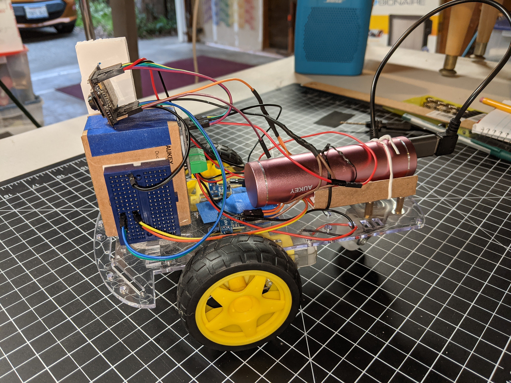
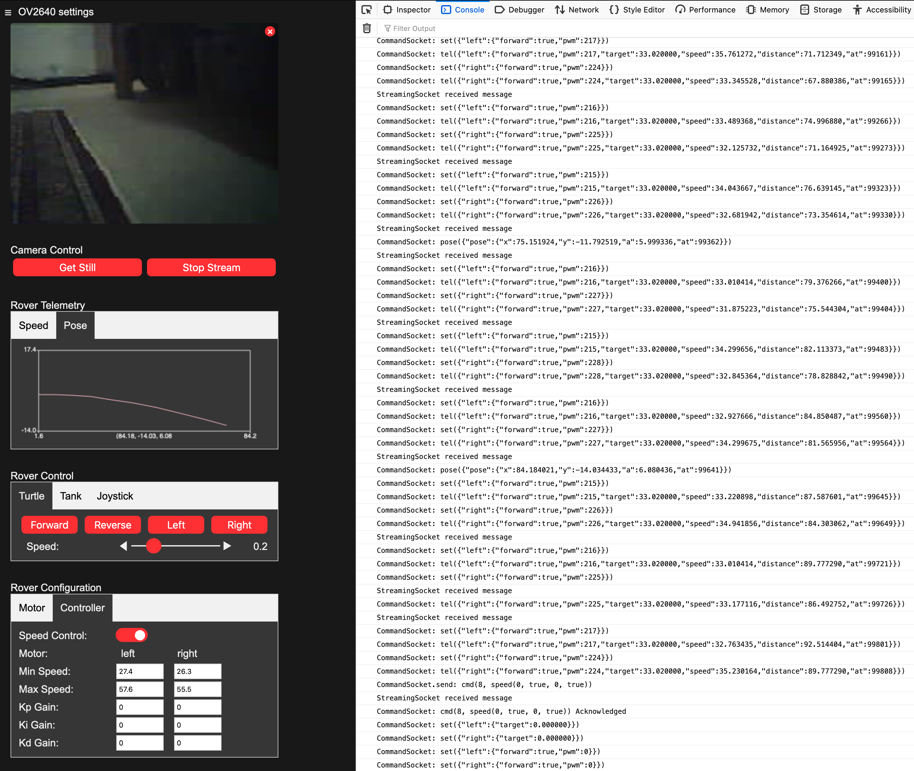

# EzRover

- [Description](#description)
- [Status](#status)
- [The Software](#the-software)
    - [Rover Firmware](docs/rover_firmware.md)
    - [Web Application](docs/web_client.md)
      - Here is a [video](https://youtu.be/yN2ya2mlBNU) that describes the web application.
- [The Hardware](docs/building_the_rover.md)
- [Todo](docs/todo.md)
- [Tags](tags/tags.md)
- [Setup](#setup)

## Description
EzRover is not a sketch; it is a framework for powering cheap, capable and extensible differential drive robots.

The repository includes a C++ application that runs on the rover and a JavaScript web application that is served by the rover and is used to command the rover and to receive and visualize video and telemetry.  

The framework implements important robot primitives in the C++ application such as a websocket command protocol, closed loop speed control, pose estimation and go to goal behavior.  These primitives are implemented in C++ and run on the rover so they run fast and with low latency.

In addition, the rover serves it's own JavaScript web application which is used to calibrate and command the rover and to visualize video and telemetry from the rover.  The JavaScript web application is a distinguishing feature of this framework.  It can be used to extend the rover's capabilities using a friendly programming language (JavaScript) and powerful technologies like OpenCV.js and Tensorflow.js.

This repository includes the parts list and a set of instructions for building an inexpensive differential drive robot using an ESP32Cam micro controller, an inexpensive motor controller and a commonly available Robot Car chassis.  The result is a cheap, capable, extensible robot that can be used by hobbyists or in school settings for experiencing and learning about robotics.
- Sub-$40 bill of materials, no 3D printing and little or no soldering
- Closed-loop motor control, pose estimation, go to goal and path following.
- Remote control using a First Person View video streaming and game controller or mobile phone
- Extensibility via JavaScript, OpenCV and Tensorflow

So two important requirements are:
- The robot must be inexpensive
- The robot must be easy and safe to build

The capabilities listed above then create some other requirements;
- The robot must have it's own battery so it can operate remotely and untethered.
- The robot must have a camera to enable a first persion view for the remote operator and as a sensor for autonomous navigation.
- The robot must have odometry (using wheel encoders) for precise control of speed, trajectory and distance.
- The robot must have wifi communication to enable effective remote control from a computer or cell phone.

The chassis for the robot is a very commonly available kit that includes two dc motors, two wheels, a caster wheel and a clear plastic chassis/platform to mount everything on.  Construction is very simple.  The only soldering required is to attach 2 wires to each of the 2 motors and there are even ways of avoiding that.  

The other nice thing about these kits is that they come with wheel encoder disks; we can add two optocouplers to enable precise odometry for the robot, which is important in a number of scenarios.

The Esp32 Cam was chosen because it is a very inexpensive microcontroller that includes a camera, bluetooth and wifi.  It also comes with the header pins pre-soldered, which eliminates the need for a lot of soldering.  This is nice for beginners and for scenerios where a hot soldering iron is undersirable.  

Wiring of the robot is done using inexpensive and easy to find jumper wires with pre-crimped dupont connectors.  For the most part, we have chosen components that have pre-installed header pins so we can just connect to them using these pre-fabricated jumper wires.  This makes wiring primarily solderless.  The possible exceptions to this are the dc motors.  Each motor has two terminals that need wires connected. It turns out that soldering lead wires to such terminals is really easy, even if this is your first time using a soldering iron.  If the robot is to be assembled in a class room setting, then the wires could be pre-soldered by a teacher.  However, there are alternatives; motors can be purchased that have the lead wires presoldered.  These tend to be a little more expensive are are rarely found in a complete kit, but they can be purchased separately.

## Videos
Here a some videos that show the EzRover and web application is action:
- [EzRover 01 Introduction](https://youtu.be/yN2ya2mlBNU)
- [EzRover 02 Calibration](https://youtu.be/ciDCUUx8MXI)
- [EzRover 03 Go to Goal](https://youtu.be/_eKCqswX5D0)
- [EzRover 04 Go to Goal](https://youtu.be/TjE9ceNOTJE)

## Contributing
There are lots of ways to contribute to this project.  First, clone the repo and try it out.  If you have ideas for cool features please add a Feature Request to issues; I really want to know how you would like to use this project.  If you build the project and find any bugs, please add a bug issue.  If you want to add to the code or fix a bug, please clone the repository and make a pull request.  If you like robots and JavaScript, please star this repository; that will help us a lot.  Thanks!

## The Software
The rover software is really two big pieces; 
- The [rover code](docs/rover_firmware.md) that controls the motors and the camera runs in the ESP32 microcontroller is written in C++ (Arduino flavor).
- The client [web application](docs/web_client.md) that is used to drive the rover and view camera video runs in a browser and consists of an html file, a few css files and many JavaScript files.  

This is not a sketch; it is a framework.  It is a framework for powering cheap, capable, and extensible differential drive robots.

## Status
Latest code has a pretty nice web ui and decent closed-loop speed control and go-to-goal behavior.  My thinking on the project and where it can offer value or provide a differentiated capability has evolved.  Originally I wanted to create the lowest-cost robot capable of competing in a [DIYRobocars](https://diyrobocars.com/) race.  The current [Minimum Viable Racer](https://diyrobocars.com/2018/11/23/updated-minimal-viable-racer-to-use-latest-openmv-linear-regression-code/) is based on the OpenMV Cam, which is a super-nice intelligent camera with onboard compute.  A Minimum Viable Racer would cost a little under $100 to build.  I think this project could be used to create a MVR for about $40.  I still think that is true, but think there is another place we can get to that offers a broader value.  I think this project can become a cheap robot platform that provides solid primitives (speed control, pose estimation, go to goal, command protocol, telemetry and camera streaming) in a self-hosted web application that is extensible in JavaScript.  Cheap, Capable, Extensible.  

### Cheap
This project specifies a hardware BOM that is easy to get, easy to assemble and **costs under 40$** USD.  It does _not_ require a 3D printer.  It can be built with minimal or no-soldering.

### Capable
Ultimately, I would like this project to enable autonomous robotic capabilities.  It is common to see inexpensive robots based on an Arduino Uno or Nano and the same or similar rover chassis and motor controller as this project uses.  These are basically the same cost to build as this project.  They may add a set of IR sensors and provide a line-following behavior.  Or they may provide an ultrasonic sensor and provide an obstacle-avoidance/random-walk kind of behavior.  Sometimes they will provide a bluetooth adapter and a mobile app so the robot can be driven by the user with a mobile phone.  These are all good robots and I would recommend building one or another.  However, none of these are truly autonomous; the line following robots require that you draw lines for them, the obstacle-avoidance robots don't know where they are or where they are going; they just avoid stuff, and the remote control robots require you to drive them.  Autonomous robots require more capable sensors and must be able to estimate and control their position.

- **Camera**: In it's simplest use, streaming video from the camera allows the rover to show a First Person View, FPV, and facilitates remote teleoperation capability.  When combined with computer vision algorithms, a camera equipped robot can execute many autonomous behaviors; line following, lane keeping, obstacle detection, image recognition, camera SLAM and many more.  

- **Wheel Encoders**: integration of wheel encoders for feedback and a kinematic model enables 3 important robot capabilities:
  - speed control: precisely control the speed of the rover under program control
  - pose estimation: understand the position and orientation of the robot as it moves
  - go-to-goal behavior: navigation to a specific location under program control.
- **Wifi** and **web** connectivity: This allows the robot to be controlled over the web; commands can be sent and telemetry can be received.  This is the key to extensibility.
  - command protocol
  - rover telemetry

### Extensible
It's not a sketch, it's a framework for differential drive robots. 

The basic capabilities of the rover are built-in; speed control, pose estimation, go-to-goal behavior.  Those are written in C++ and execute directly on the rover's microcontroller.  Because we have chosen a microcontroller with WIFI and HTTP, the robot can self-host it's own web application and user-interface. This is where a lot more capability can be added in an easy to use language; JavaScript.  Since the rover serves it's own web application, the robot can be run without the need to install a separate client application; just open the application in any browser on a computer or mobile phone.  The application is written in it's own framework with minimal required dependencies so it is very easy to build and debug using standard browser development tools.  

The rover web application can send commands to the rover and it can receive telemetry from the rover so it knows the rover's state.  It allows the rover to be driven by keyboard, game controller or algorithmic control.  There is a graphics library that plots telemetry and position in real-time.  Detailed telemetry can be viewed in the browser's console.  The rover can also stream video from the camera to the rover application.  With powerful JavaScript libraries, like OpenCV.js and Tensorflow.js, computer vision and deep learning algorithms can be run against the camera input.  By leveraging the built-in speed control, pose estimation and go-to-goal primitives, higher-level behaviors can be created like goal selection, path planning, sign-recognition and real-time obstacle detection and avoidance; the building blocks of an autonomous vehicle. 

- Self-hosted **web application**
- Extensible with **Javascript**
  - **OpenCV**.js
  - **TensorFlow**.js
- Debuggable: since much of the robot's code is in JavaScript, the browser's **development tools** can be used to debug.

#### Useful Extensions
These would be great things to add to the the JavaScript application.
- OpenCV.js camera calibration
- OpenCV.js camera line following
- Camera lane keeping (OpenCV.js or TensorFlow.js)
- Path representation and Pure Pursuit path following
- Map representation and path planning
- Traffic sign and traffic light recognition (TensorFlow.js)
- Obstacle recognition and avoidance (Tensorflow.js)

### What would you like to see?
- Add an enhancement request to the github issues.  That can begin the discussion.  It would be great to know how you want to use the rover.
- Before you add a new issue, please search the current issues to see if there is one that covers your concern.  If there is, add to that discussion.  Thanks.

## Setup
I'm using Visual Studio Code and the Platform I/O plugin for embedded development.  It's nice because it can handle the C/C++ code and the HTML/CSS/JavaScript code all in one IDE.
- Install Visual Studio Code: https://code.visualstudio.com/
- Install Platform I/O into Visual Studio Code: https://platformio.org/platformio-ide
- git clone the repo to your local machine
- open the cloned project folder in Visual Studio Code

See [Rover Firmware](docs/rover_firmware.md) for a detailed explaination of setup and code building.

NOTE: Currently I do not have a Windows batch scripts that are equivalent to the Bash shell scripts in the tools folder that are used to bundle the client assets into the rover firmware.  You could do this in a Linux shell if you have installed Linux Subsystem for Windows.  It may also work in the Git for Windows shell or Cygwin. You can also run a VM.  https://itsfoss.com/run-linux-commands-in-windows/  Lastly, if you create equivalent batch scripts, please think about opening a pull request so the community can use them.  Thanks.
