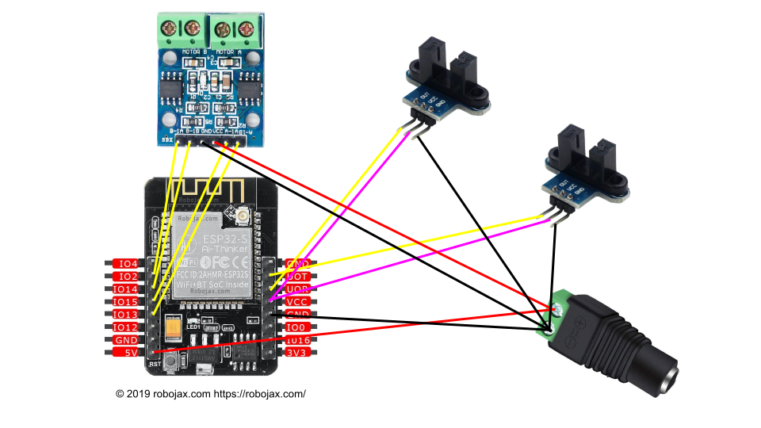

## Building the Rover
The parts are readily available from many suppliers.  I will provide links to Amazon (fast delivery) and AliExpress (low prices), but there are other suppliers that you may prefer.  Think of these links as a description of what you can get and about how much it will cost, rather than a suggestion for any particular supplier.  You may also choose to buy two at a time as this will also save money if you want spare parts or a second robot.  Also, it is sometimes easier to test code on parts rather than a fully assembled robot, so a second set of parts can be handy that way.

## Bill of Materials

### ESP32 Cam
This is a ESP32-S with an OV2640 camera.
- [Amazon](https://www.amazon.com/SongHe-ESP32-CAM-Development-Bluetooth-Arduino/dp/B07RB2J4XL/ref=sr_1_7)
- [AliExpress]()

### USB to TTL converter
This is used send the program to the ESP32 Cam and read the output of the serial port.  There are a lot of different variations of this kind of board.
- [Amazon](https://www.amazon.com/HiLetgo-CP2102-Converter-Adapter-Downloader/dp/B00LODGRV8/ref=sr_1_4)
- [AliExpress]()

### L9110S DC Motor Driver
This is used to control the two motors of the robot chassis.  It is connected to the ESP32 Cam pins to get 'commands' and to the two DC Motors to provide them with power and control signals.  This is a great chip for controlling small DC motors (and stepper motors) and they are cheaper when you buy several, so if you are interested in building with small DC motors, this is a great, inexpensive motor driver.
- [Amazon](https://www.amazon.com/Comimark-H-Bridge-Stepper-Controller-Arduino/dp/B07WZFGS81/ref=sr_1_14)
- [AliExpress]()

### Smart Robot Car Chassis Kit
These kits can be had from many vendors.  They contain a clear plastic platform with mounting holes, two DC geared motors, two wheels and tires, one omnidirectional caster wheel, two optical encoder disks (for measuring speed; usable if you also get the IR Optocouplers below), a toggle switch, a battery box (which we are not going to use), a little wire and all the necessary mounting hardware.
- [Amazon](https://www.amazon.com/MTMTOOL-Smart-Chassis-Encoder-Battery/dp/B081GYVB6C/ref=sr_1_4)
- [AliExpress]()

These kids generally come with lead wires for connecting the dc motors, but they are not generally pre-soldered to the motors.  That means a little soldering.  That would be a good beginner's soldering task.  But if you don't want to solder at all then there is an alternative; you can purchase the motors with the wire leads already soldered.  They are more expensive, but they do avoid soldering. (see AdaFruit)

Presoldered Motors
- [Amazon](https://www.amazon.com/Gearbox-Motor-Wheel-Arduino-Smart/dp/B07P6QCJPX/ref=sr_1_12)
- [AdaFruit](https://www.adafruit.com/product/3777)

### IR Slotted LM393 Optocoupler
These, in combination with the optical encoder discs that come with the Smart Robot Car Chassis Kit, can be used to measure wheel rotation, so you can precisely measure speed and distance travelled.  Note that you can find several different kinds of these slotted Opto-interrupters.  The ones with the header pins on the opposite side of the board from the IR detector slot works best because the pins point 'up' while the slot points 'down'.  On some other kinds, the pins also point down and prevent the module from seating propertly.
- [Amazon](https://www.amazon.com/gp/product/B081W4KMHC/ref=ppx_yo_dt_b_asin_title_o06_s00)
- [AliExpress](https://www.aliexpress.com/item/32773600460.html)

Slotted Optical Disks
If you are not buying a kit, you may need to purchase the disks separately.
- [AliExpress](https://www.aliexpress.com/item/32966921400.html)

### Dupont wires
You should have a mix of male-male, male-female, female-female and 10cm and 20cm.
- [AliExpress](https://www.aliexpress.com/item/1005001705264902.html)

## Instructions
TODO

### Wiring

```
                          Left      Right      USB 5V
Esp32Cam       L9110S     LM393     LM393      Battery
--------       ------     -----     -----      -------
GPIO 15 <-----> A1_A
GPIO 13 <-----> A1_B
GND     <-----> GND  <---> GND <---> GND <---> (-) GND
5V      <-----> VCC  <-----------------------> (+) 5V
GPIO 2  <-----> B1_A
GPIO 14 <-----> B1_B
GPIO 3  <----------------> OUT
GPIO 1  <--------------------------> OUT
VCC     <----------------> VCC <---> VCC
```


ESP32 image (c) 2019 [Robojax.com](https://www.robojax.com)

- Note that this wiring diagram is one way to do it.  It matches what is found in `src/config.h`
```
// pin assignments for motor controller
const int A1_A_PIN = 15;          // left forward input pin
const int A1_B_PIN = 13;          // left reverse input pin
const int B1_B_PIN = 14;          // right forward input pin
const int B1_A_PIN = 2;           // right reverse input pin

// wheel encoder config
const int LEFT_ENCODER_PIN = 3;   // left LM393 wheel encoder input pin
const int RIGHT_ENCODER_PIN = 1;  // right LM393 wheel encoder input pin
```
- The VCC pin of the ESP32Cam outputs 3.3 volts.  We use that to supply the LM393 with 3.3 volts from the Esp32Cam so that the LM393 output pin outputs 3.3 volts, which is compatible with the Esp32cam GPIO pins.  If supply the LM393 with 5 volts, then it's output will be 5 volts and the Esp32 GPIO pins do not tolerate 5 volts.
- Esp32Cam GPIO pin 1 is also the serial transmit pin (TX) and GPIO pin 3 is also the serial receive pin (RX).  We use those pins (and GND) to connect a USBtoSerial converter when we want to download the firmware to the rover or transmit serial output to the host computer.  We can't have both the USBtoSerial converter and the LM393 encoder output pins connected to those pins at the same time.  See [Downloading the Firmware to the Rover](./rover_firmware#downloading_the_firmware_to_the_rover) to see how that can be handled.

### Improving the Hardware
- PCA9685 to send pwm to motors.  The PCA9685 would be connected via I2C, so it would save a couple of input pins.  More importantly, we could add additional devices to the I2C serial bus without using any more pins.  That opens up a lot more hardware extensibility by just adding a $4 part.  It also now frees up two pins, so we can move the encoders to those pins and re-enable the serial output.
- IMU to improve dead reconning.  If we add the PCA9685, then one of the sensors we could add to the I2C bus is an IMU.  This could be used to improve dead reconning accuracy.  In particular, it would help mitigate the biggest weakest with the wheel encoders; wheel slip detection.  The IMU, since it measures accelerations, could detect wheel slip.  We would then fuse the output of the IMU with wheel encoders.
- OLED screen so we can show the rover's ip address on startup and other telemetry when running.  Again, if we are using a PCA9685 and the I2C bus, we can add this device to the I2C bus.  This would eliminate the hassle associated with finding the rover's IP address.