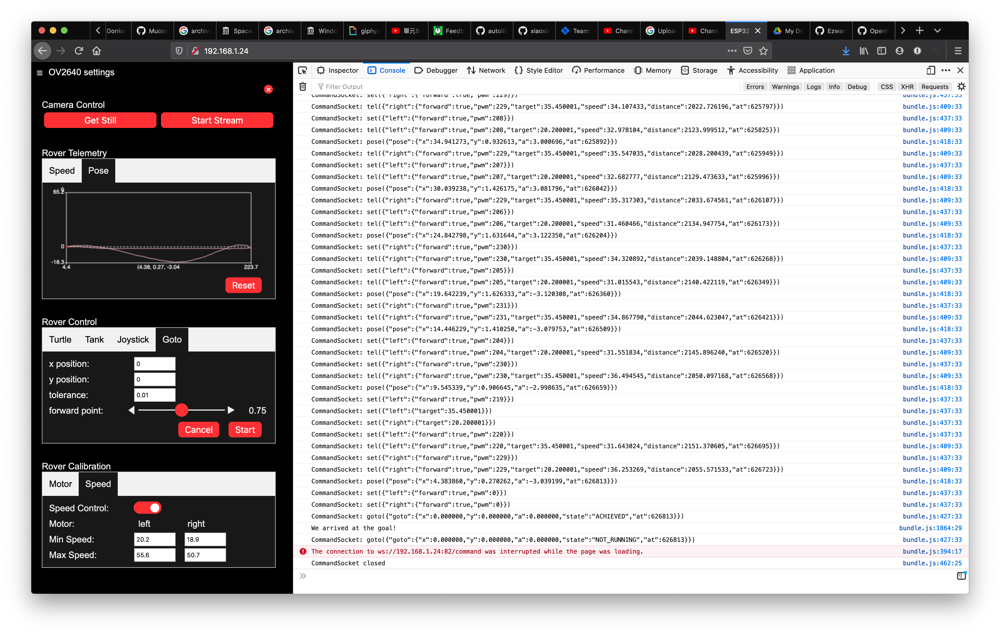

## Rover control
Controlling the rover is done with the web application.  There are 3 control modes;
- ***Turtle Control*** : This is is like a Logo 'turtle'; you can move forward, backward, turn left and turn right.  This is done with 4 buttons in the web UI.
- ***Tank Control*** : In this mode, each wheel is controlled separately and can go forward or backward.  This is done using a connected game controller and two of the analog axis, one for each wheel (see how to connect a game controller to your browser below).
- ***Joystick Control*** : In this mode, the rover is controlled with one analog joystick (or one for steering and one for throttle) using a connected game controller (see how to connect a game controller to your browser below). 
- ***Go to Goal*** : In this mode, you provide an (x,y) position and the rover drive's itself there and stops.

- TODO: document how to get wifi address of ESP32 (turn off wheel encoders and get address from serial monitor; use wifi router to fix rover's DHCP ip address in the router)

### 4 Button Turtle Control 
In 4 button Turtle control mode, the rover has 4 movement commands; forward, turn left, turn right, and reverse.  The speed command sets the speed of the motors.  So when a direction command is given, the speed is based on the most recent speed command.  Finally there is the stop command, which will stop the motors.  
- forward
- turn left
- turn right
- reverse
- stop
- speed

Here is a video that demonstrates [Turtle mode](https://youtu.be/yN2ya2mlBNU) control.

Turtle Control is simple to understand and makes it easy to plan a route; it can also be implemented simply with UI buttons or a keyboard.  The left-turn and right-turn commands are really 'spin' commands; the rotation is around the center of the robot, between the two wheels.  If effect, it is like a 'turtle graphics' kind of control.  So Turtle control mode allows the bot to go forward or backward in a straight line and to spin left or right.  Smooth turns are not really possible, but must be broken up into short strait lines connected with small turns (like approximating a circle with a polygon).

The browser application provides 4 buttons in the UI to send these commands to the rover.  When a direction command is sent by clicking a direction button in the browser application, the command is sent and the button turns to a 'stop' button and the other 3 direction buttons become disabled until the 'stop' button is pressed.  This makes it visual obvious that the user should send a 'stop' command between movement commands.

In addition, the browser application binds the arrow keys on the keyboard of a desktop or laptop or Chromebook to send these commands to the rover.  The arrows keys are mapped as you might expect; up-arrow = forward, left-arrow = turn left, right-arrow = turn right, and down-arrow = reverse.  The application code always inserts a stop command between movement commands to make sure there is no attempt to change direction dramatically (like directly from full forward to full reverse) that has the possibility of damaging the motor's gears.

This is the default mode and works with any desktop or mobile browser.

### Tank Control
In tank control mode, each motor is controlled separately and can go either forward or backward with a specified speed.
- left forward/reverse
- right forward/reverse

This mode is meant to be used with a gamepad that has at least two analog joystick controls, like an XBox One controller or a Playstation 2, 3, or 4 controller.  Typically the left joystick's vertical axis would be used to drive the left wheel; push forward to turn the wheel forward, pull back to turn the wheel backward.  The speed of rotation is determined by how far the stick is moved.  Similarly, the right joystick is generally used to control the right wheel.

Because of the analog nature of the controls, much smoother movements can be created using this mode.

Tank control is enabled when a gamepad with at least two joysticks is connected to the computer that is running the browser application and a button or joystick on the gamepad is pressed or moved.

### Joystick control
In joystick control mode is meant to be used with a gamepad that has at least one analog joystick (the existence of 2 'axes' is assumed to mean one joystick).  One axes controls the forward/reverse speed (push forward to go forward, pull back to reverse) and the other axes controls turning (push left to turn left, push right to turn right).  The speed is determined by how far the joystick is pushed forward or backward and the angle or the turn is determined by how far the joystick is moved left or right.
- forward/reverse
- left/right

Joystick mode is perhaps the most natural driving mode.  

Note that it is also possible, on a gamepad with two analog joystics, to map the vertical axis of one joystick for forward/reverse and the horizontal axis of the other joystick for left/right turns.

Joystick control is enabled when gamepad with at least one analog joystick is connected to the computer that is running the browser application and a button or joystick on the gamepad is pressed or moved.

### Browser Gamepad support
Tank Control and Joystick Control require a gamepad connected to the machine running the browser application. Detection of the gamepad controller and configuration of the axes is done using the HTML5 gamepad API.  To make this mode available, you must first connect a gamepad controller that has at least one analog joystick for Joystick Control or two analog joysticks for Tank Control (actually, the existence of 2 'axes' is assumed to be a joystick, so 4 axes is assumed to be two joysticks).  Note that after the gamepad is connected to the computer, you must press a button or move a joystick before it is detected by the browser.

This has been tested on the latest Chrome and Firefox 77.01
- Firefox 77.01 on MacOS Catalina 10.15.5
- Chrome 83.0.4103.116 on MacOS Catalina 10.15.5

It appears the Apple Safari does not support the HTML5 Gamepad API.

### Go To Goal
In Go To Goal mode, you input an (x,y) position and the rover drives to that position and stops.  Accuracy depends upon good calibration of motor stall PWM, minimum speed and maximum speed for each wheel.  This capability distinguishes this rover from most other super-cheap rovers.  This is also implemented as a command that can be sent to the rover using JavaScript, and telemetry is returned that tells the web applcation when the goal is achieved.  Once you are ready to start hacking the rover's web applcation, you can use this basic behavior and string many together to get the robot to do more complex behaviors.

Here is a video that demonstrates the [Go to Goal behavior](https://youtu.be/_eKCqswX5D0) in action.  Here is another with side-by-side video of [EzRover and the telemetry](https://youtu.be/TjE9ceNOTJE) on the web application.