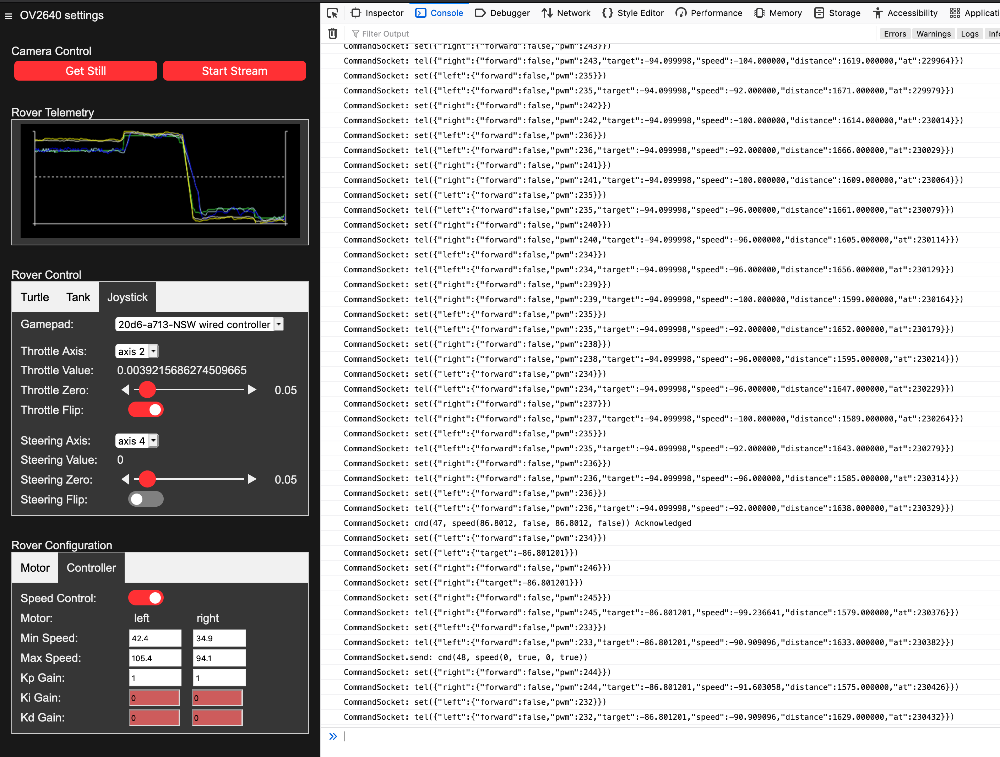

## The Web Client
The rover code not only controls the motors and the camera, it is actually a web server that serves the client web application as html, css and JavaScript.  



Most web servers would serve such assets (html, css, javascript) by reading the files from a file system on disk, then sending them via http to the client.  However, we do this a little differently.

The ESP32 Cam does have a 'disk' in that we could use an sd card to hold the files, and we could write the server to read these files, then server them as they are requested.  We actually are not doing it that way because this would add an extra step in getting code to the rover; first we would need to upload the rover code to the ESP32 Cam via the serial connection, then we would need to pull out the SD card, insert it into the computer with which we are editing the code, write the client/ folder to the SD disk, pull out the SD card and reinsert it into the ESP32 Cam.  If both of these steps are not followed, we run the risk of having a set of rover code that is not compatible with the files on the SD card.  

Instead of reading the html, css and JavaScript from the SD card, we turn them into code that is then compiled into a large data array that duplicates what we would have read from disk, but in computer memory.  We then serve that to the client over http.  This requires a bundling and asset conversion step (see below). This done with tool scripts in the `/tools` folder; these steps could easily be added to a build system (like a Makefile).  Another big advantage in our context is that this makes serving those files much faster, since we don't have to read them first from an SD card.

### Asset bundling
The client web application uses a few separate css files and many javascript files.  We want to serve each of these in it's own single request from the client, rather than serving dozens of individual requests for the individual files.  To do that we simply concatenate all the css files into a single css file and all the javascript files into a single JavaScript file.  The bundled css and bundled javascript can then be served in just two requests.  We do this bundling with a bash script.

```
    tools/bundle_assets.sh
```

If you look at the `tools/bundle_assets.sh` bash script you will see that it explicitly copies all .js files to `bundle.js` and all .css files to `bundle.css`.  Note that if you add or remove a .css or .js file from the project, you will need to modifiy the bundling script accordingly.


### Serving assets
The file `client/index.html` is the html app that is loaded when the user hits the root url ('/').  To serve this file, we compress it using gzip and convert the resulting file to an array of bytes in a c-language header file `src/index_html.h`.  There is a bash script that is used to do this process with a single command; `tools/asset_to_c_header.sh`.  It takes two arguments; the first is the name for the asset file to compress, the second is the name of the output header file.  We do the same thing with the bundled javascript and bundled css.  So to create the header files used to serve the web application, run these commands from the root of the project;

```
tools/asset_to_c_header.sh index.html index_html.h
tools/asset_to_c_header.sh bundle.js bundle_js.h
tools/asset_to_c_header.sh bundle.css bundle_css.h
```

Both the bundling and conversion to c-header can be done in one step by calling the tools/bundle.sh script from the root of the project folder.

```
tools/bundle.sh
```

The next time you upload the rover application to the ESP32, the header files will be compiled into the rover application and uploaded with the rest of the rover code.  The are then served from memory (see src/main.c, )

### Debugging the Web Application

The web application is pure html, css and JavaScript, so the developer tools built into your browser (Firefox and Chrome) will do an excellent job of helping you to check your changes and debug the application.  

This can be done by simply opening the web ui served by the rover and then opening the browser developer tools.  However, in some cases it can be useful to debug the web application locally rather than having to upload it to the rover and start the rover.  For instance if you are only modifying css.  

We can serve the web application using a web server on the machine running your IDE.  It uses a version of the html, `index_unbundled.html`, that loads each JavaScript and css file individually, so you don't have to run the bundling steps to see your changes.  In this case the web application does not actually communicate to the rover, but it does allow you to make visual changes to the web application and quickly check them.

If you have installed nodejs as described in [Software Setup](./software_setup.md#client-toolchain) then you have installed a web server that can be used locally.

```
    $ cd client
    $ npx http-server
    Starting up http-server, serving ./

    http-server version: 14.1.1

    http-server settings: 
    CORS: disabled
    Cache: 3600 seconds
    Connection Timeout: 120 seconds
    Directory Listings: visible
    AutoIndex: visible
    Serve GZIP Files: false
    Serve Brotli Files: false
    Default File Extension: none

    Available on:
    http://127.0.0.1:8080
    http://127.94.0.3:8080
    http://127.94.0.2:8080
    http://127.94.0.1:8080
    http://10.0.0.135:8080
    http://172.27.239.20:8080
    Hit CTRL-C to stop the server
```
- Goto the url `http://127.0.0.1:8080/index_unbundled.html` to see the local version of the client app.  You can then open the developer tools using the browser's menus.

>> Chrome developer tool docs: https://developer.chrome.com/docs/devtools/

>> Firebox developer tool docs: https://firefox-source-docs.mozilla.org/devtools-user/

### Web Application UI
The web application UI is organized as follows:

- Camera Control
- Rover Telemetry
  - Motor Telemetry
  - Pose Telemetry
- Rover Control
  - Turtle Control
  - Tank Control
  - Joystick Control
  - Go To Goal
- Rover Calibration
  - Motor Stall
  - Motor Speed

#### Camera Control
This section allow you to show a image or video from the camera and to set many camera settings.  

#### Rover Telemetry
When the rover is driving it sends data back to the web ui.  This section allows you to see two kinds of telemetry.  

The first set of telmetry data shows how fast each motor is turning so you can see how the speed control is operating.  This can help you determine if the calibration values are accurate and/or if the PID values are working well.

The second set of of telemetry that is available is it the robot pose; the estimated position and heading of the robot.  This allows you to see if the pose estimation is working well; is the estimate showing in the rover's path the same or close to what the rover is actually doing?

#### Rover Control
This section provides ways to drive the rover.  There are 4 control modes that the framework supports for driving the rover.

- ***Turtle Control*** : This is is like a Logo 'turtle'; you can use the dialog buttons or the keyboard to move forward, backward, turn left and turn right.  This is done with 4 buttons in the web UI.
- ***Tank Control*** : In this mode, each wheel is controlled separately and can go forward or backward.  This is done using a connected game controller and two of the analog axis, one for each wheel (see how to connect a game controller to your browser below).
- ***Joystick Control*** : In this mode, the rover is controlled with one analog joystick (or one for steering and one for throttle) using a connected game controller (see how to connect a game controller to your browser below). 
- ***Go to Goal*** : In this mode, you provide an (x,y) position and the rover drive's itself there and stops.

See [Rover Control](./rover_control.md) for more details.


#### Rover Calibration
Rover calibration allows you to enter measured values for stall value, minimum speed and maximim speed that the rover has.  These values vary from rover to rover because they are related to the specific motors and battery being used.  Accurately measuring these values makes it so the rover can do a better job of controlling it's speed and turning.  You can find more detailed information on how to measure and set these values at [Rover Calibration](./rover_calibration.md)

### Web Application Internals and Extension Points

The JavaScript code is organized as follows:

- calibration
  - motor     -- Javascript to calibrate motor's stall characteristics
  - pid       -- Javascript to calibrate the motor's speed range and PID controller
- camera      -- JavaScript for streaming camera images over a websocket
- command     -- Javascript for sending commands to the rover over a websocket
- config      -- Javascript with configuration values
- control
  - turtle    -- JavaScript for driving the rover using turtle movement
  - joystick  -- JavaScript for driving the rover with a game controller
  - goto_goal -- JavaScript for driving the rover to a specific position
- telemetry
  - motor     -- Javascript for drawing the motor speed graph
  - pose      -- JavaScript for drawing the rover's position and orientation graph
- utilities   -- JavaScript for various utilities
- view        -- JavaScript for widgets and view related utilities
- main.js     -- This is the entry point for the web application.


#### Object pattern
If you browse the JavaScript files in the `client/js` folder you will see some common patterns in these files.  Typically there is a constructor function that returns an 'instance' as a simple JavaScript object that has a number of functions exposed.  Something like this;

```JavaScript
function FooBar(giver) {
    
    function foo() {
      _baz(`${giver} gives a foo.`);
      return self;
    }

    function bar(getter) {
      _baz(`${getter} gets a bar`);
      return self;
    }

    function _baz(message) {
      console.log(message)
    }

    const self = Object.freeze({
      "foo": foo,
      "bar": bar
    });

    return self;
}
```

And it can be used like this;

```JavaScript
    const theFooBar = FooBar("Jesse");
    theFooBar.foo();
    theFooBar.bar("James");
```

Note that we commonly create 'fluent' apis; methods return the `self` object so that calls can be chained.  For instace we could rewrite the above example as:

```JavaScript
    const theFooBar = FooBar("Jesse");
    theFooBar.foo().bar("James");
```


This is very simple, vanilla JavaScript that is easy to understand.  The constructor's arguments as well as all local variables and functions are captured in a JavaScript closure.  This allows for powerful patterns; we can truly hide private variables and methods in the object and only expose the public api; private variables and methods start with an underscore (`_`) by convention.  Further the public api can be frozen, as it is in this case, so it cannot be altered in any way.  If we want a singleton object then we can immediately execute the constructor function and set a `const` property, like is done in [`ViewWidgetTools`](../client/js/view/view_widget_tools.js), so there is only ever one of them.  We can pass these objects to the constructors of other objects, thus using composition and dependency injection to organize the application.  If you look at the entry point for the application, [`main.js`](../client/js/main.js) you will see that a lot of what it does is construct objects, very often passing these to other constructors as depedencies, until we have constructed everything we need to run the application.

We chose this very simple pattern because:
- it is vanilla JavaScript; it will run in all browsers and can be debugged in with the browser's developer tools without the need to carry around symbol files.
- it is simple to understand
- it provides powerful enforcement of visibility and immutability of object's api.
- it encourages composition and dependency injection rather that object orientation and inheritance.
- it requires no extra tooling
- because of all of the above it will stand the test of time; bit rot should be not be an issue.

### Common kinds of objects
The kinds of objects/functionality implemented in the JavaScript code fall into a few kinds:

- **models**: Models hold data (also called 'state').  A model may be a simple object with getters and setters or it may be implemented as a [`RollbackState`](../client/js/utilities/rollback_state.js) object which can track which properties have been modified and commit or rollback those modifications.  A model may also use a [`MessageBus`](../client/js/utilities/message_bus.js) to publish a message when any of it's properties change, so that other parts of the application can take an action based on that.

- **view-controllers**: A view-controller manages a part of the view (a part of the ui).  That may be an individual control, like a [range control](../client/js/view/widget/range/range_widget_controller.js), or it may be a more complex piece of ui made of many controls, like the [motor calibration pane](../client/js/calibration/motor/motor_view_controller.js).  View-controllers keep the state of the view in a model (the view state model) and update their elements to match the state if the state changes.  A dom event is emitted when the user interacts with an element controlled by the view-controller; for instance a 'click' event is emitted if a button element is clicked. The dom event is handled by the view controller; it updates its view state model based on the event and if the view state actually changed then any affected elements are redrawn to match the new state.  Redraw always happens using the animation loop so we can gather a number of state updates into a single redraw that is smooth and seemless.

- **widgets**: A widget is an individual ui control, like a button or a graphic image.  This is a special kind of view-controller that deals with a 'single' control that may be made of multiple html elements.  The [`RangeWidgetController`](../client/js/view/widget/range/range_widget_controller.js) is an example of a composite widget; it uses a slider element, a numeric input element and two buttons to manage a numeric value. The [`TabViewController`](../client/js/view/widget/tabs/tab_view_controller.js) is another example of a composite widget; it manages a set of elements that act as tabs; at any time one of the tabs is active and the others are inactive; the view-controller publishes events via a [`MessageBus`](../client/js/utilities/message_bus.js) when the active tab changes so that other controllers can adjust themselve accordingly. 

- **view-managers**: View-managers manage and coordinate several view-controllers.  For instance a tab group will have a view-controller for each pane and another view-controller for the tabs themselves.  The view-manager typically uses a message bus to listen for events from the tab view so it knows which view should be active; it can then activate that pane's view-controller (show it and start it listening for events/messages) and deactivate the other panes' view-controllers (hide them and stop them from listening for events/messages).

- **utilities**: Most other code falls into the category of utilities; typically code that makes doing something a little easier.  For instance the [dom utilities](../client/js/utilities/dom_utilities.js) make it easier to interact with dom elements and the [`ViewStateTools`](../client/js/view/view_state_tools.js) make it easier to maintain and enforce the view state maintained in a ['RollbackState`](../client/js/utilities/rollback_state.js) model.

### MessageBus
We mentioned message bus a number of times when talking about controllers.  A message bus is an object that routes messages between other objects.  Messages are a name and value (data).  An object can subscribe to a message by name on a message bus.  When another object publishes a message with that name on that message bus then the subscriber object's `onMessage()` method is called and passed the message name and value.  It can then do what it wants with it.  More than one object can subscribe to a message and all of them will be notified in the order that they subscribed.  It is possible to use more than one [`MessageBus`](../client/js/utilities/message_bus.js) to different kinds of messages segmented.

The purpose of the message bus is to 'decouple' objects.  When using a message bus the publishing object and the subcriber objects don't know anything about each other except that they are sharing a [`MessageBus`](../client/js/utilities/message_bus.js) object. If we did not use a message bus then the publisher would have to call each subscriber directly; so each subscriber object would have to be passed to the publishing object as a dependency, perhaps through the constructor.  This would tightly fix these relationships.  If another object needed that data then the publisher would have to be modified to use it as a dependency.  This makes the code rigid and difficult to maintain.


### View-controller Life Cycle methods
It is worth doing a deeper dive on view-controllers, since they implement all of the interactivity in the user interface.  View-controllers implement a set of functions designe to move the controller through a life-cycle.

- **Construction**: the constructor function is called and passed the necessary inputs; minimally the css selector(s) necessary to find the elements that the view-controller will manage and sometimes a [`MessageBus`](../client/js/utilities/message_bus.js) that the controller will either subscribe to and/or publish on and sometimes a model that the view-controller will update.  The constructor will create the initial view state model.

- **`attachView()`**: This will use the css selector(s) passed to the constructor to lookup the dom element(s) that it will control.  After this is called then the view-controller's `isViewAttached()` method will return `true` if the dom element(s) could be found.

At this point the controller is constructed and has found the dom elements that it is in charge of.  The next two methods 'activate' the view so it can be used.

- **`startListening()`**:  This will attach dom event listeners to the elements under control and may, if a ['MessageBus'](../client/js/utilities/message_bus.js) was passed to the constructor, subscribe to messages.  In this way the controller is able to react to user events or messages from another object. After this is called then `isListening()` will return `true`.
- **`showView()`**:  This will make the controller's dom elements visible so the user can start interacting with them.  After this is called `isViewShowing()` will return `true`.

Once the view is attached and the controller is listening for events/messages and the view is showing, then the view is up an running.  The user may interact with it, any changes to the view state will be reflected in updates to the view.  

We can deactivate the view by reversing the last two life-cycle steps.

- **`hideView()`**:  This will hide the dom elements that the view-controller manages.  Note that `hideView()` must be called for each time that `showView()` was called (handling 'nested' calls).  The view will be hidden only after the `hideView()` calls balance out the `showView()` calls.
- **`stopListening()`**: This will remove all dom event listeners and unsubscribe from any messages.  Note that `stopListening()` must be called for each time that `startListening()` was called; the event listeners will only be removed when the `stopListening()` calls balance out the `startListening()` calls.

>> Note that if a view is hidden then you should always make sure it is not listening; you don't want the user's input to be handled by hidden ui.

At this point the view is deactivated.  We could reactivate it by calling `startListening()` and `showView()` again.  Or if we are all done with it we can finish the object's lifecycle.

- **`detachView()`**: This will throw away all references to the dom elements, so that the controller object is not hanging onto dom elements that may get destroyed.

Once `detachView()` is called the object can be 'thrown away' or it can be used again provided that the arguments passed to the original constructor are still valid (for instance, the css selectors will still resolved to dom elements).

Note that the api is 'fluent'; most methods return the `self` instance so calls can be chained.  For instance, starting up a view-controller might look like;

```JavaScript
const theViewController = ViewController(containerCss);
theViewController.attachView().startListening().showView();
```